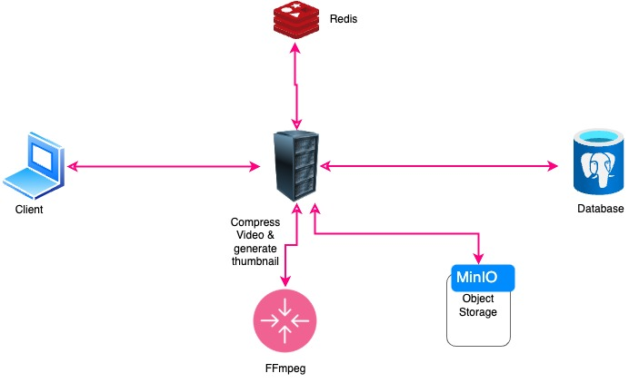

# ReelStream

ReelStream is a video streaming platform that enables users to upload, view, like/unlike videos, and access analytics. It is built using a microservices architecture and leverages technologies like `PostgreSQL`, `Redis`, `Minio`, `FFmpeg`, and `Prometheus` for monitoring.

---

## Table of Contents

- [Features](#features)
- [Setup Instructions](#setup-instructions)
- [API Documentation](#api-documentation)
- [Architecture Diagram](#architecture-diagram)
- [Technical Decisions](#technical-decisions)

---

## Features
- TypeScript-based REST API with proper error handling
- Video processing service:
  - Validate video format (mp4 only)
  - Max duration: 60 seconds
  - Max size: 50MB
  - Generate thumbnails
- Caching strategy for video metadata
- Rate limiting implementation
- Logging system for API tracking
- Basic analytics for video views and engagement
- JWT-based authentication (User registration & login)
- Database migrations and index optimization

## Setup Instructions

### Prerequisites
1. **Docker**: Ensure Docker and Docker Compose are installed.

### 1. Clone the Repository

```bash
git clone https://github.com/fahimahammed/ReelStream-Server.git
cd ReelStream-Server
```

### 2. Set Up Environment Variables

Copy the example environment file and configure necessary values:

```bash
cp .env.example .env
```

Ensure variables such as `DATABASE_URL`, `JWT_SECRET`, and others are correctly set.

### 3. Build and Start Docker Containers

Run the following command to start all services:

```bash
docker-compose up --build
```

This initializes the `backend`, `PostgreSQL`, `Redis`, `Minio`, and other dependencies.

### 4. Access the Application

- **Backend API**: `http://localhost:3000`
- **Minio Console**: `http://localhost:9001` (Username: `fahim`, Password: `fahim123`)
- **Prometheus Dashboard**: `http://localhost:9090`


---

# API Documentation

## Authentication

### 1. Register User

- **Endpoint**: `POST /api/v1/auth/register`
- **Description**: Register a new user.
- **Request Body**:
  ```json
  {
    "name": "Fahim",
    "username": "fahimahammed",
    "email": "fahimahammed5@gmail.com",
    "password": "fahim123@"
  }
  ```
- **Response**: Success or error response.

### 2. Login User

- **Endpoint**: `POST /api/v1/auth/login`
- **Description**: Login a user.
- **Request Body**:
  ```json
  {
    "email": "fahimahammed5@gmail.com",
    "password": "fahim123@"
  }
  ```
- **Response**: Authentication token (JWT).

### 3. Refresh Token

- **Endpoint**: `POST /api/v1/auth/refresh-token`
- **Description**: Refresh the user's JWT token.
- **Response**: New authentication token.

### 4. Get My Profile

- **Endpoint**: `GET /api/v1/auth/me`
- **Description**: Retrieve the current user's profile.
- **Request Headers**:
  - `Authorization`: Bearer `<token>`
- **Response**: User profile details.

---

## Video Management

### 5. Upload Video

- **Endpoint**: `POST /api/v1/video/upload`
- **Description**: Upload a video.
- **Request Headers**:
  - `Authorization`: Bearer `<token>`
- **Request Body** (Form Data):
  - `video`: Video file (e.g., `.mp4`)
  - `data`: JSON object containing video metadata:
    ```json
    {
      "title": "How to upload video?",
      "description": "Here i show how to upload video on minio."
    }
    ```
- **Response**: Success or error response.

### 6. Get Videos

- **Endpoint**: `GET /api/v1/video`
- **Description**: Retrieve a list of videos.
- **Query Params**:
  - `page`: Page number for pagination.
  - `limit`: Limit number of pagination.
- **Response**: List of videos.

### 7. Get Video By ID

- **Endpoint**: `GET /api/v1/video/:videoId`
- **Description**: Retrieve a specific video by its ID.
- **Response**: Video details.

### 8. Like/Unlike Video

- **Endpoint**: `POST /api/v1/video/:videoId`
- **Description**: Like or unlike a specific video.
- **Request Headers**:
  - `Authorization`: Bearer `<token>`
- **Response**: Success or error response.

---

## Analytics

### 9. Get My Profile Analytics

- **Endpoint**: `GET /api/v1/analytics`
- **Description**: Get analytics for the user's profile within a specific date range.
- **Query Params**:
  - `startDate`: Start date for the analysis period (e.g., `2025-01-01`).
  - `endDate`: End date for the analysis period (e.g., `2025-02-31`).
- **Request Headers**:
  - `Authorization`: Bearer `<token>`
- **Response**: Analytics data for the user.

---

## System Health & Metrics

### 10. Health Check

- **Endpoint**: `GET /health`
- **Description**: Check the health status of the system.
- **Response**: Health status message.

### 11. Metrics

- **Endpoint**: `GET /metrics`
- **Description**: This endpoint exposes system metrics in a format compatible with Prometheus. These metrics provide insights into the performance and usage of the API, such as the total number of API requests, response times, and other system health indicators.
- **Response**: The response includes various Prometheus-formatted metrics, such as counters and histograms, which can be scraped by Prometheus for monitoring.

#### Example Response:

```plaintext
# HELP api_requests_total Total number of API requests
# TYPE api_requests_total counter
api_requests_total{method="GET",status_code="200"} 53
api_requests_total{method="POST",status_code="201"} 2
api_requests_total{method="POST",status_code="200"} 5
api_requests_total{method="POST",status_code="404"} 1
api_requests_total{method="GET",status_code="201"} 1

# HELP api_response_duration_seconds API response duration in seconds
# TYPE api_response_duration_seconds histogram
api_response_duration_seconds_bucket{le="0.1"} 59
api_response_duration_seconds_bucket{le="0.2"} 59
api_response_duration_seconds_bucket{le="0.5"} 61
api_response_duration_seconds_bucket{le="1"} 61
api_response_duration_seconds_bucket{le="2"} 61
api_response_duration_seconds_bucket{le="5"} 61
api_response_duration_seconds_bucket{le="+Inf"} 62
api_response_duration_seconds_sum 8.209678709999995
api_response_duration_seconds_count 62
```

- [API Documentation - POSTMAN](https://documenter.getpostman.com/view/41621562/2sAYQiCU7b) 

#### How to Use:

1. **Query Metrics**: 
   Once Prometheus is scraping the metrics, you can query them using the Prometheus UI:
   - **URL**: `http://localhost:9090`
   - **Example Query**: `api_requests_total`
   - You can query specific metrics like:
     - `api_requests_total`: Number of API requests
     - `api_response_duration_seconds`: API response durations
     - `api_requests_total{method="GET"}`: GET request count
     - `api_requests_total{status_code="200"}`: 200 OK status code count
     - `api_response_duration_seconds_bucket`: Response durations in different time buckets

2. **Monitor Metrics**: Query the metrics directly from the Prometheus UI:
   [Monitor API Metrics](http://localhost:9090/query?g0.expr=api_requests_total&g0.show_tree=0&g0.tab=graph&g0.range_input=1h&g0.res_type=auto&g0.res_density=medium&g0.display_mode=lines&g0.show_exemplars=0)
   - This link allows you to view the API request metrics over the past hour and graph them for easy monitoring.

This setup allows you to track API performance and request metrics in real-time through `Prometheus`.

---

## Architecture Diagram




### Components:
- **Frontend**: Communicates with the backend.
- **Backend**: Handles API requests (Node.js + Express).
- **PostgreSQL**: Stores structured data.
- **Redis**: Improves performance with caching.
- **Minio**: Manages video storage.
- **FFmpeg**: Processes video encoding and generates thumbnails.

---

## Technical Decisions

### **1. PostgreSQL**
- Chosen for its relational database capabilities, ideal for structured data.

### **2. Redis**
- Utilized for caching frequently accessed data, enhancing performance.

### **3. Minio**
- Provides scalable object storage, compatible with AWS S3.

### **4. JWT Authentication**
- Ensures secure, stateless user authentication.

### **5. Docker & Docker Compose**
- Facilitates consistent development and deployment environments.

### **6. FFmpeg**
- Used for video processing, including encoding, transcoding, and thumbnail generation.

### **7. Prometheus**
- Monitors system performance and collects metrics.

### **8. Socket.io**
- Get real time video uploading progress updates.

---


<!-- # important command

docker run \
  -p 9000:9000 \
  -p 9001:9001 \
  --name minio \
  -v ~/minio/data:/data \
  -e "MINIO_ROOT_USER=fahim" \
  -e "MINIO_ROOT_PASSWORD=fahim123" \
  quay.io/minio/minio server /data --console-address ":9001"

  prometheus --config.file=prometheus.yml -->
